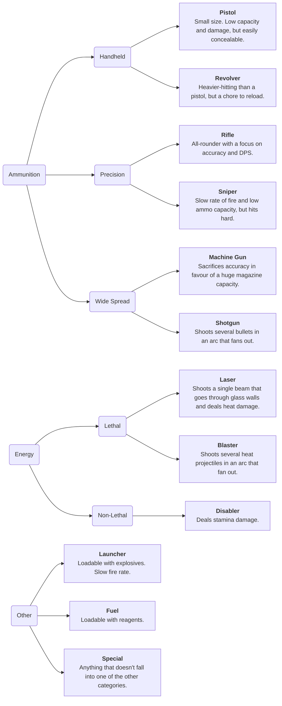

# Gun Overhaul

| Designers | Coders | Implemented | GitHub Links |
|---|---|---|---|
| DVD Player, mqole | DVD Player, iaada | :x: | TBD |

## Introduction

Guns in SS14 have a medium-high barrier of entry. 

Most guns in game take specific forms of ammunition, some can toggle between different modes, have different stats, most of which are conveyed using the examine menu. However, unless the player has experience with gun terminology, there is a lot of mental overhead required to memorize all of these statistics for each individual entity. Which gun takes shotgun shells, and which gun takes .35 precision ammo? What is the difference between a Drozd and a Lecter? And why do all these guns look so similar?

To ease the learning burden, the design of guns should prioritise:
- **Glance value.** Visual designs should be distinctive and signal the gun's properties.
- **Minimal examine text.** Provide only the information that the player needs - no need to focus on the details at first blush.
- **Distinct categories.** Sorting every gun into player-facing boxes can quickly clue a player in to what to expect from how a gun handles.
- An optional **advanced stat viewer.** Keep all the numbers and details on a seperate tab so those who are interested in combat can still get into the weeds.

## Sorting Guns

Here is the proposed categorisation system for guns:

### Categories

All guns should fit into exactly one of the following **categories**, determined by the type of ammunition they accept and their general identity.

### Qualities

From this base category system, each gun then has two *qualities*. Qualities should give a general overview of the gun's unique characteristics, and serve as an at-a-glance description of the gun's stats. For example:

- An Mk 58 as a *balanced*, *back-up* **pistol**
  - Generally balanced stats, but more of a sidearm than a main weapon
- A Drozd as a *rapid-fire* **machine gun**
  - Extremely fast rate of fire
- An Enforcer as a *wide-spread*, *balanced* **shotgun**
  - Balanced stats, and fans bullets out in a wide arc to increase area of effect
- A China Lake as an *aggressive*, *demolition* **launcher**
  - It's scary, and it will explode things
- A Kammerer as a *precision* **shotgun**
  - A smaller arc of bullets makes it harder to hit a target, but those bullets do more damage
- A Musket as a *precision* *haymaker* **sniper**
  - Heavy hitting ammo, and it doubles as a melee weapon

While **categories** are static identifiers that exist to denote a gun's accepted ammunition and general purpose, *qualities* are more flexible and subjective. These two systems of categorisation combine to provide a lot more glance value to guns.

Categories and qualities should be **player-facing**. This may be done through highlighted examine text, or some other means. The priority is ensuring that players are able to quickly recognize and understand a gun's function.

Visual design of guns should also be considered. Gun sprites and designs should intuitively convey to players the gun's category and some signifier of its qualities or overall identity.

It's vital to note that categories are intended to **intuitively provide information to players**. As such, subverting these categories (by designing a rifle which has the functions of a shotgun, for example) is confusing and muddies the information this system intends to provide. This kind of subversion of categories should be avoided as a general rule.

## File Structure

In order to comprehensively organize all the gun entities in the game, the YAML entity files will need to be cleaned up as follows:

- A file `base-guns.yml` containing base entities (eg. `BasePistol`, `BaseShotgun`) for each gun category.
  - The base entities should be parented from `BaseItem` and given a 'baseline' indication of what that gun's average stats are in terms of reload speed, fire rate, ammo capacity, etc.
- Individual files (`pistols.yml`, `shotguns.yml`, etc.) for each category containing all the gun entities that fit that category.
  - In these files, users may also define additional base prototypes in order to create guns which have a shared identity but differ in aesthetics- for example, creating entity `BasePistolLight` in `pistols.yml`, which becomes the parent of both `WeaponGunMk58` and `WeaponGunViper`.

These new entities may be selectively overwritten by downstreams of Macrocosm. It may be useful to use a naming scheme such as `MACROGunViper` to ease the process of editing Macrocosm entities.