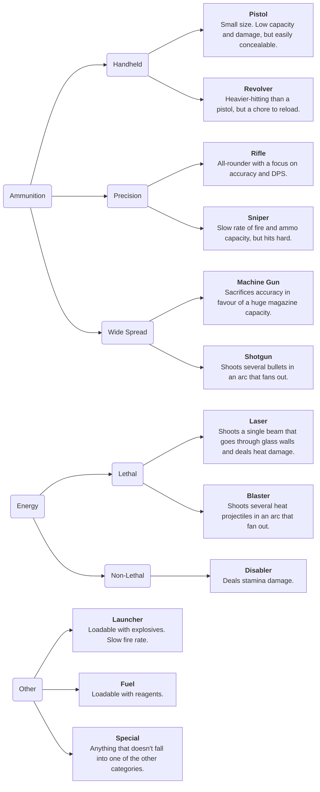

# Weapons/Guns Organization

| Designers | Coders | Implemented | GitHub Links |
|---|---|---|---|
| DVD Player, mqole | DVD Player, iaada | :x: | TBD |

## The Default “Upstream” Folders

This collection is meant to be a very basic collection that any server who has forked from Macro but done no work will be able to just make use of right out the gate. Entity IDs will be intentionally named differently so that even if a fork wants to use something with the same name they don’t have to worry about overlap. 

The idea here is that balance changes made to these weapons will be made at an absolute minimum– the “base game balance” will be based off of the oldest and tried-and-true numbers from our forks without any super new concepts that can rock the boat, and keeping the count of weapons to be small and minimal. Special variations that fit a similar role but offer different takes, such as roundstart disabler/pistol loadouts for secoffs or the quirkier weapons, will not be included. Think of this as a basic hamburger with only ketchup– it will serve as a meal but if you want extra flavourings you are free to check out the other heads of the Macrocosm Hydra.

Cargo / Uplink store offerings I suggest we work off of .cvar or whatever they’re called file toggles – a way that the upstream selection can be outright ignored so it doesn’t have to be edited. This will allow downstreams to be able to have their own menus if they so please without concerns of how it’s going to affect their upmerging experience.

A lot of numbers won’t be referred to here in big details – I can provide those for the other nerds that know what things like accuracy numbers mean.

I want to address that, I’ve omitted some options for being redundant. This is by no means meant to be 

## Specific Numbers for Freaks

Below are

### Ammo Types
- .35 Auto – 16 pierce
- .20 Assault - 19 pierce
- .25 Caseless - 21 pierce
- .30 Tactical - 25 pierce
- .45 Magnum - 35 pierce
- .60 Antimateriel - 75 pierce (and that shitload of structural)
- .50 Shotgun - it’s complicated

### Security and Crew Weapons (Kinetic)
| Gun Name 	| Ammo 	| Firerate 	| Accuracy 	| Availability 	|
|---	|---	|---	|---	|---	|
| Mk 58 	| .35 Auto – 10 round magazine 	| 5 rounds per second 	| Mid Range Accuracy 	| General Security sidearm 	|
| Inspector 	| .45 Magnum - 6 round revolver 	| 1.5 rounds per second 	| Long Range Accuracy 	| Detective Sidearm 	|
| Drozd 	| .35 Auto – 30 round magazine 	| 6 rounds per second 	| Close/Mid Range Accuracy (wielded) 	| Armory Weapon – close-range/high DPS 	|
| Lecter 	| .20 Assault – 25 round magazine 	| 4.5 rounds per second 	| Mid/Long Range Accuracy (wielded) 	| Armory Weapon – balanced, jack-of-all-trades 	|
| Daito 	| .30 Tactical – 20 round magazine 	| 3 rounds per second 	| Long Range Accuracy (wielded) 	| Armory Weapon – precision, higher single-shot damage 	|
| WT550 	| .35 Auto – 30 round magazine 	| 5.5 rounds per second 	| Mid Range Accuracy 	| HoS Weapon/Cargo Order 	|
| AKMS 	| .30 Tactical – 23 round magazine 	| 3.75 rounds per second 	| Close/Mid Range Accuracy (wielded) 	| Rare Armory Weapon 	|
| Kammerer 	| .50 Shotgun – 7 round capacity 	| 1 round per second 	| Tighter Shotgun Spread (wielded) 	| Armory Weapon – “precision” and burst damage 	|
| Enforcer 	| .50 Shotgun – 7 round capacity 	| 2 rounds per second 	| Standard Shotgun Spread (wielded) 	| Armory Weapon – “the DPS option” 	|
| Double-Barreled Shotgun (Sawn-Off) 	|  	|  	|  	|  	|
| Proto-Kinetic Accelerator 	|  	|  	|  	|  	|

### Security and Crew Weapons (Energy)
| Gun Name 	| Ammo 	| Firerate 	| Accuracy 	| Availability 	| Notes 	|
|---	|---	|---	|---	|---	|---	|
| TD-95 Laser Carbine 	| 14 heat – 16 shot battery 	| 2 rounds per second 	| Hitscan 	| Armory/Research (T-1)/Cargo 	| Sucks ass but it’s cheap to print and cheap to buy. 	|
| TS-99 Blaster Pistol 	| 15 heat – 8 shot replaceable cell 	| 2.5 rounds per second 	| Projectile – mid-range accuracy 	| Research (T-1) 	| Cannot shoot through windows but minimally competent. 	|
| OL-71 Laser Rifle 	| 10 heat – 30 shot battery 	| 4.5 rounds per second (or 3-round burst) 	| Hitscan 	| Research (T-2) 	| Decent. Can’t be as good as kinetic because it’s lathe-printed and rechargeable. 	|
| EM-40 X-Ray Cannon 	| 10 heat/10 radiation – 10 shot battery 	| 2 rounds per second 	| Hitscan 	| Research (T-2) 	| Better per-shot damage, annoying damage type, lower DPS. 	|
| TW-07 Blaster Cannon 	| Explosive bolts – 3x3 explosion, ~30 damage on direct hit, 5 shot battery 	| 0.5 rounds per second 	| Projectile – long-range accuracy 	| Research (T-2) 	| It’s a big papa 	|
| X-66 Advanced Laser Pistol 	| 17 heat – 10 shot battery 	| 2 rounds per second 	| Hitscan 	| Research (T-3) 	| The jack-of-all-trades self-recharger. Very nice to have. 	|
| TT-10 Advanced Blaster 	| 28 heat – 6 shot battery 	| 1.75 rounds per second 	| Projectile – long-range accuracy 	| Research (T-3) 	| What the X-66 is to the Antique, this is to the Energy Magnum. 	|
| RA-96 temperature gun 	| Temperature gun stuff. 10 shot battery. 	| 1 round per second. 	| Projectile – long-range accuracy 	| Research (T-3) 	| A good proof-of-concept, and shows how you can combat armor differently. 	|
| Disabler 	| 30 stamina – 10 shot battery 	| 2 rounds per second 	| Projectile – long-range accuracy 	| Roundstart/Armory/Research 	| You know it. 	|
| Disabler SMG 	| 15 stamina - 30 shot battery 	| 4 rounds per second 	| Projectile – long-range accuracy 	| Research (T-1) 	| You love it. 	|
| M-1 Energy Shotgun 	| Three modes: Lethal Spread (15x4 heat) - 7 shots, Stun Spread (15x3 stamina) - 12 shots, Kinetic Shot (25 blunt 75 structural) - 12 shots 	| 2 rounds per second 	| Projectile 	| Unique (Warden) 	| The Original and Best 	|
| Type-25 Energy Magnum 	| Three modes: Lethal Shot (35 heat) - 6 shots, Stun Shot (40 stamina) - 6 shots, Flare Shot (10 heat - linger light source) - 9 shots 	| 1.5 rounds per second 	| Projectile 	| Unique (Head of Security) 	| Self-Recharges 	|
| Antique Laser Pistol 	| It’s just like the X-66 	| It’s just like the X-66 	| It’s just like the X-66 	| Unique (Captain) 	| It’s just like the X-66. 	|

### Syndicate Weapons
| Gun Name 	| Ammo 	| Firerate 	| Accuracy 	| Cost 	| Notes 	|
|---	|---	|---	|---	|---	|---	|
| Kardashev-Mosin 	| .30 Tactical – 5 round capacity 	| 0.75 rounds per second 	| Long range accuracy 	| 1 TC 	| Extra effective as a melee weapon 	|
| Viper 	| .35 Auto – 10 round magazine 	| 6 rounds per second 	| Mid range accuracy 	| 3 TC (2 on discount) 	|  	|
| Cobra 	| .25 Caseless – 10 round magazine 	| 3.4 rounds per second 	| Long range accuracy 	| 4 TC (2 on discount) 	| Silenced 	|
| Python 	| .45 Magnum – 6 round capacity 	| 2 rounds per second 	| Long range accuracy 	| 4 TC (2 on discount) 	|  	|
| Adder 	| 9.5 heat + 9.5 pierce – 12 shot capacity 	| 4 shots per second 	| Long range accuracy 	| 5 TC (3 on discount) 	| Echion fuel gun (15u capacity) 	|
| Anaconda 	| .60 Antimateriel – 3 round capacity 	| 1 round per second 	| Long range accuracy 	| 8 TC (6 on discount) 	| Self-damages the shooter 	|
| Hypnalis 	| .50 Shotgun – 4 round capacity 	| 2 rounds per second 	| 20% wider shotgun spread 	| 10 TC (8 on discount) 	| Silenced 	|
| Akurra 	| 8.5 Heat + 8.5 Pierce – 30 shot capacity 	| 5.3 shots per second 	| Mid range accuracy 	| 12 TC (8 on discount) 	| Echion fuel gun (30u capacity) 	|
| Lindwyrm 	| .60 Antimateriel – 5 round capacity 	| 0.4 rounds per second 	| Super long range accuracy (Scope functionality) 	| 12 TC (6 on discount) 	|  	|
| C20-r Gorgon 	| .35 Auto – 30 round capacity 	| 8 rounds per second 	| Close-mid range accuracy 	| 17 TC (10 on discount) 	| Auto-ejects empty magazines 	|
| Basilisk-11 	| .25 Caseless – 24 round magazine 	| 5 rounds per second est. (burst fire) 	| Long range accuracy 	| 18 TC (13 on discount) 	|  	|
| Hydra 	| .50 Shotgun – 8 round magazine 	| 2 rounds per second 	| Standard shotgun spread 	| 20 TC (12 on discount) 	|  	|
| China Lake 	| Grenades, baby!! 	| 0.5 rounds per second 	| Long range accuracy 	| 25 TC (20 on discount) 	|  	|
| L6 “Nidhogg” SAW 	| .20 Assault – 100 round magazine 	| 8 rounds per second 	| Close/mid range accuracy 	| 30 TC (24 on discount) 	|  	|

### Greytider Guns
| Gun Name 	| Ammo 	| Firerate 	| Accuracy 	| Availability 	| Notes 	|
|---	|---	|---	|---	|---	|---	|
| Zipper 	| .35 Auto – 6-round magazine 	| 3 rounds per second 	| Lmfao 	| Random maints loot 	|  	|
| Improvised Shotgun 	| .50 Shotgun – 1-round capacity 	| It’s a single round capacity 	| Standard shotgun spread 	| Crafted with a pipe, modular receiver, and wooden stock 	| Additional improvised ammo for this can be crafted 	|
| Improvised Pistol 	| .35 Auto – 8-round capacity 	| 2 rounds per second 	| Close/mid-range accuracy 	| Crafted with a modular receiver, pen, and makeshift loader (crafted w/ steel) 	| Can be loaded with .45 magnum as well, but all ammo must be found. 	|
| Makeshift Laser 	| 12 heat – 8-shot battery 	| 1.75 rounds per second 	| Hitscan 	| Crafted with a modular receiver, a crystal, and several electronics parts 	| Deals shock damage to shooter with a chance to stun if they are not wearing insulated gloves 	|
| Improvised Pneumatic Cannon 	| Storage launcher 	| 2 rounds per second 	| Long range accuracy 	| Crafted with pipes, handcuffs, and steel 	|  	|

